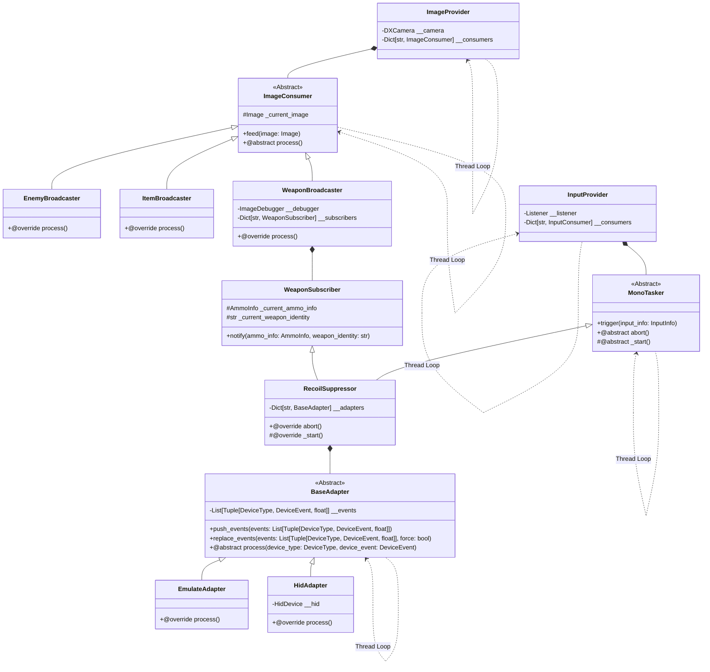

## Overview

## References

### Tools

- [Apex Legends Calculator](https://jscalc.io/embed/Q1gf45VCY4tmm2dq)
- [Mouse Sensitivity Calculator](https://www.mouse-sensitivity.com/?share=598ee2e60b31d9226578d809f7380a09)

### Articles

- [Apex Legends Calculator blog](https://jscalc-blog.com/apex-legends-calculator/)